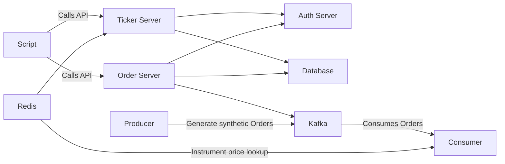

# Demo of Distributed System with Observability

## [Work in progress]


## Table of Contents

- [Introduction](#introduction)
- [Design](#)
- [Prerequisites](#prerequisites)
- [Run](#run)
- [References](#references)

## Introduction

This project is centered around the simulation of a stock market environment through the utilization of distributed
systems and a message broker for seamless communication among different components of the system. In this simulation,
producers generate synthetic stock price data as well as buy and sell orders, while consumers execute these orders and
ensure the system stays up-to-date.

The system offers APIs that allow traders to list their orders, review their portfolio, and create new orders for buying
or selling. Additionally, it provides APIs for accessing information on available stock instruments, including their
last traded price and more.

As part of its design, the system incorporates observability features, enabling the tracking of various aspects within
the system. This enhances transparency and facilitates in-depth analysis of its functioning.

_Please note that this simulation is a simplified version and might not represent real-world trading conditions or all
aspects of a complex stock market._

## Prerequisites

- [Docker](https://www.docker.com/products/docker-desktop/)
- [Docker Compose](https://docs.docker.com/compose/)
- [httpie](https://httpie.io/)
- [make](https://formulae.brew.sh/formula/make)

## Build

```shell
mvn clean install
```

## Run

Start docker containers:

```shell
make start-docker
```

Start Java apps:

```shell
make start-apps
```

With all services up, access:

| Description             | Port/Link                  | Additional Info                          |
|-------------------------|----------------------------|------------------------------------------|
| Postgres                | 5432                       |                                          |
| Postgres UI             | http://localhost:5050      | U: `pgadmin4@pgadmin.org`<br/>P: `admin` |
| Kafka UI                | http://localhost:8080      |                                          |
| Redis UI                | http://localhost:8050      |                                          |
| Grafana UI              | http://localhost:3000      |                                          |
| Keycloak                | http://localhost:9000      |                                          |
| Eureka Service Registry | http://localhost:9900      |                                          |
| Spring Boot Admin       | http://localhost:9800      |                                          |
| Auth Service            | http://localhost:9901/docs |                                          |
| Ticker Service          | http://localhost:9902/docs |                                          |
| Order Service           | http://localhost:9903/docs |                                          |
| App UI                  | http://localhost:9910      | U: `test`<br/>P: `test`                  |

Generate traffic:

```shell
make traffic
```

Stop apps:

```shell
make stop-apps
```

Stop docker containers:

```shell
make stop-docker
```

Design:



### Images

Spring Admin:


Service Registry:


Service Registry:


Service Details via Service Registry:


Service Logs via Service Registry:


Central Dashboard - Service Logs:


Central Dashboard - Stats of HTTP Requests (Latency/Throughput):


Sample Exemplar:


Sample Trace:


Sample Logs for a Trace:


Service Graph for a Trace:


Full Service Graph:


### Improvements:

- [ ] Filter by URLs of a selected service/application on `HTTP Stats` Grafana Dashboard
- [ ] Instrumentation of Redis APIs
- [ ] Instrumentation of consumer

### References:

- https://www.youtube.com/watch?v=fh3VbrPvAjg&ab_channel=SpringI%2FO
- https://spring.io/guides/tutorials/metrics-and-tracing/
- https://stackoverflow.com/questions/76418005/not-able-to-trace-database-requests-with-spring-boot-3-and-micrometer
- https://github.com/micrometer-metrics/micrometer-samples/blob/main/micrometer-samples-boot3-database/src/main/java/io/micrometer/boot3/samples/db/SampleController.java
- https://docs.spring.io/spring-boot/docs/current/reference/html/actuator.html
- https://www.confluent.io/blog/monitor-kafka-clusters-with-prometheus-grafana-and-confluent/